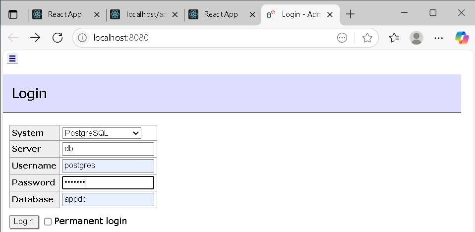
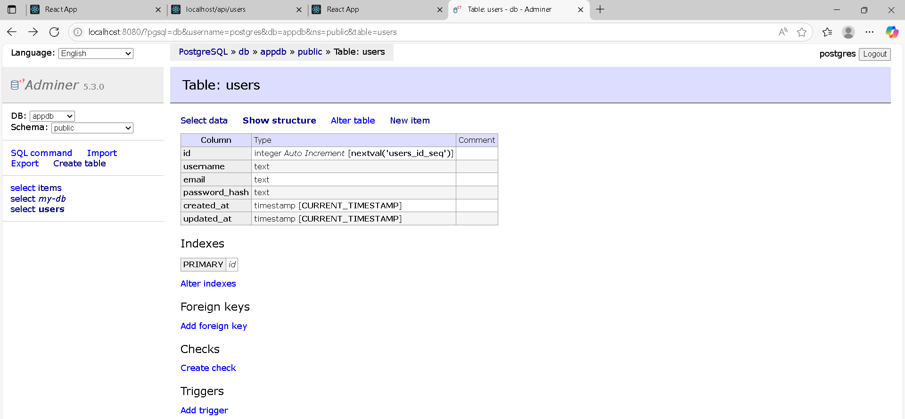
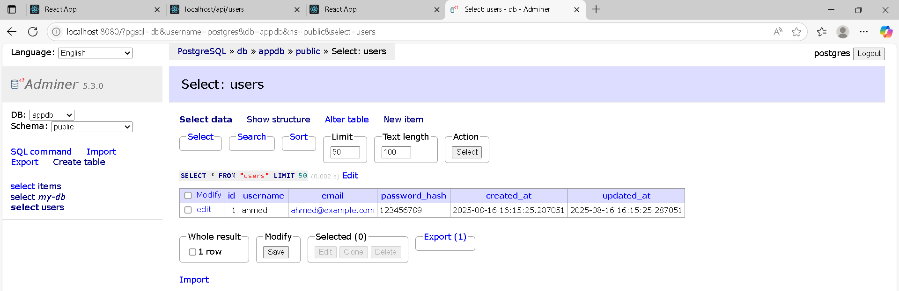
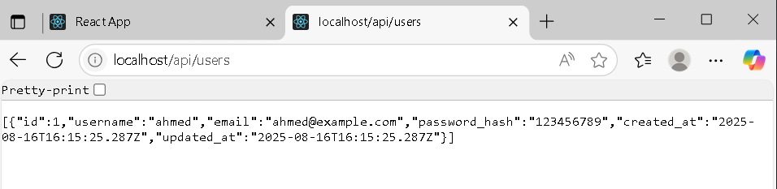
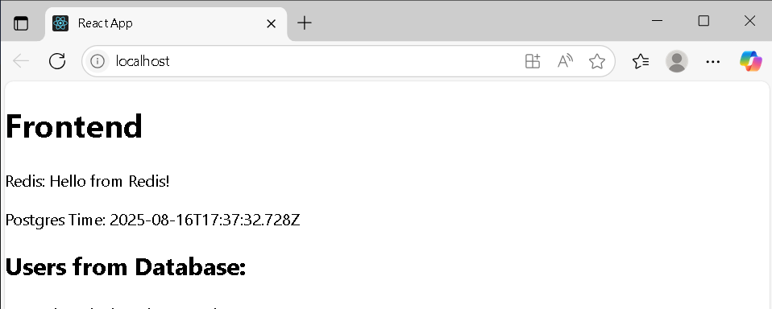

1. **First:** Login to DB


2. **Second:** Go to DB and Create A Table (users), add a  Field to the "users" Table


3. **Forth:** Add Data to the User


4. **last:** Data will show on frontEnd & BackEnd



---

# Docker Microservices Starter

> A full‑stack microservices setup with React (frontend), Node.js/Express (backend), PostgreSQL, Redis, Nginx (reverse proxy), and Adminer, all orchestrated with Docker Compose.

---

##  Table of Contents

- [Overview](#overview)  
- [Architecture](#architecture)  
- [Prerequisites](#prerequisites)  
- [Installation & Setup](#installation--setup)  
- [Usage](#usage)  
- [Environment Variables](#environment-variables)  
- [Project Structure](#project-structure)
- [Troubleshooting](#Troubleshooting)  
- [Testing](#testing) *(if applicable)*  
- [Contact](#contact)  
- [License](#license)

---

## Overview

This repository demonstrates a small, production‑like microservices environment using containers:

1. **Frontend** – SPA UI (React or plain HTML/JS)
2. **Backend** – REST API (Node.js/Express)  
3. **Database** – PostgreSQL for persistence
4. **Cache** – Redis for caching / sessions / rate‑limiting
5. **Reverse Proxy** – Nginx routing traffic to UI and API
6. **DB Admin** – Adminer for quick DB inspection

All services are isolated and connected on a Docker network via Docker Compose for easy local dev and reproducible demos.

Repository: ```https://github.com/AhmedDev374/docker-microservices-starter```
   
---

## Architecture

```plaintext
┌──────────┐        ┌──────────┐        ┌──────────────────┐
│          │  HTTP  │          │  SQL   │                  │
│ Frontend ├────────► Backend  ├────────►  PostgreSQL DB   │
│ (React)  │        │ (Express)│        │                  │
└────┬─────┘        └────┬─────┘        └──────────────────┘
     │                   │
     │  HTTP             │  TCP
     ▼                   ▼
  ┌───────┐          ┌────────┐
  │ Nginx │◄────────►│ Redis  │
  └───────┘          └────────┘
        ▲
        │
        ▼
    ┌────────┐
    │Adminer │ (DB UI)
    └────────┘
```
Typical endpoints (adjust if you change ports):

- **Nginx (entrypoint):** http://localhost:80
- **Frontend (direct):** http://localhost:3000
- **Backend API (direct):** http://localhost:3001
- **Adminer:** http://localhost:8080

---

## Prerequisites

Before running the project, ensure you have the following installed on your system:

1. **Docker** – 24.x or later
2. **Docker Compose** – v2.x (bundled with recent Docker Desktop)

Verify:

```plaintext
docker --version
docker compose version
```

---

## Installation & Setup

1. **Clone the repository**:
```plaintext
git clone https://github.com/AhmedDev374/docker-microservices-starter.git
cd docker-microservices-starter
```

2. **Copy the environment template (if applicable):**:
```plaintext
cp .env.example .env  # or create .env if none exists
```
Then open .env and set your environment variables (DB credentials, ports, etc.).

3. **Build & start all services:**:
```plaintext
docker compose up --build
```

3. **Access the application:**:
- Through Nginx (recommended): http://localhost

- Adminer (DB UI): http://localhost:8080
   - **System:** PostgreSQL
   - **Server/Host:** ```postgres```
   - **User:** from ```.env```
   - **Password:** from ```.env```
   - **Database:** from ```.env```

> For first‑time local development, seed data or migrations may run automatically on backend startup (check backend README or scripts).

---

## Usage

- **Frontend:** open the browser at the Nginx URL (or direct port if you run without Nginx) and interact with the UI.
- **Backend API:** test with curl or Postman, either via Nginx or direct to the service.
```plaintext
# Hitting the API through Nginx (if /api is proxied there)
curl http://localhost/api/health

# Hitting the API directly on the backend port
curl http://localhost:3001/api/health
```
---

## Environment Variables

Create a```.env```  in the project root. Common entries (match to your ```docker-compose.yml```):

```plaintext
# PostgreSQL
POSTGRES_DB=app
POSTGRES_USER=app
POSTGRES_PASSWORD=secret
POSTGRES_PORT=5432

# Backend
BACKEND_PORT=3001
DATABASE_HOST=postgres
DATABASE_PORT=5432
DATABASE_USER=${POSTGRES_USER}
DATABASE_PASSWORD=${POSTGRES_PASSWORD}
DATABASE_NAME=${POSTGRES_DB}
REDIS_HOST=redis
REDIS_PORT=6379

# Frontend
FRONTEND_PORT=3000
VITE_API_URL=http://localhost/api  # if using Nginx proxy
# or VITE_API_URL=http://localhost:3001/api  # direct backend

# Nginx
NGINX_HTTP_PORT=80

# Adminer
ADMINER_PORT=8080
```
> **Note:** Actual names may differ. Check the provided .env and docker-compose.yml in this repo to keep values consistent.

---

## Project Structure
```plaintext
docker-microservices-starter/
├── backend/           # Node.js/Express API (Dockerized)
├── frontend/          # React (or HTML/JS) UI (Dockerized)
├── nginx/             # Reverse proxy config (e.g., default.conf)
├── docker-compose.yml # Orchestrates all services
├── .env               # Centralized environment vars
└── README.md
```
---

## Troubleshooting

- **Port already in use** – stop conflicting local services or change published ports in ```docker-compose.yml```.

- **Services can’t talk to each other** – use service names (e.g., ```postgres```, ```redis```, ```backend```) as hosts inside containers, not ```localhost```.

- **Adminer can’t connect** – ensure ```Server``` is ```postgres``` (the service name), and credentials match ```.env```.

- **Hot reload** – if using bind mounts for dev, ensure the ```Dockerfile``` and compose dev profile copy or mount source correctly; restart containers after changing ```node_modules```.

---

## Testing (if applicable)

If tests exist in ```frontend```/```backend```, run them locally (outside Docker) or via a test profile:

```plaintext
# Backend
cd backend
npm install
npm test

# Frontend
cd ../frontend
npm install
npm test
```

You can also add a ```docker-compose.test.yml``` to spin up ephemeral test services.


---

## Contact

For questions or feedback, reach out to Ahmed at

1. **LinkDin**: https://eg.linkedin.com/in/ahmed-atef-elnadi-8165a51b9

---

## License

This project is licensed under the **GNU General Public License v3.0**.  
See the full license text here: [LICENSE](LICENSE).

